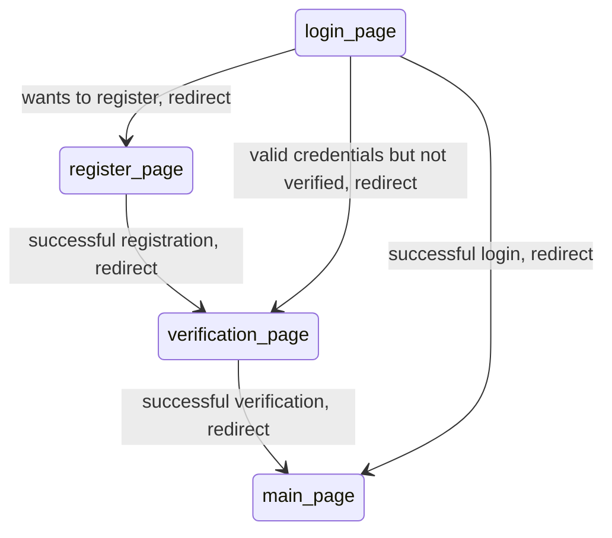

# ScottyConnect Web App

## Getting Started

### Backend

Dependency Installation
```
cd backend

python3 -m venv venv
source venv/bin/activate

pip install -r requirements.txt
```

Running the server
```
cd backend
source venv/bin/activate

python3 run.py
```

### Frontend

```
npm install

npm run dev
```

## Documentation

### Login Workflow
